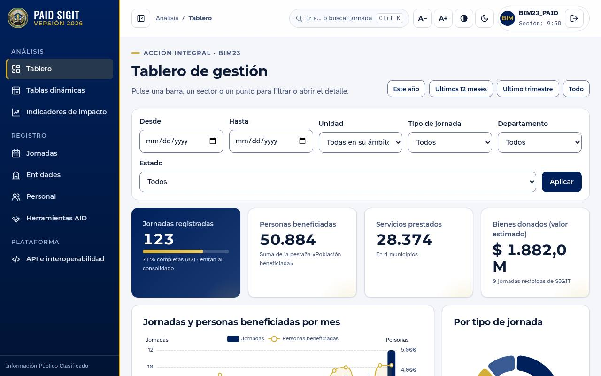

# PAID SIGIT · Versión 2026

Plataforma de Acción Integral y Desarrollo de la Armada de Colombia, con la
metodología **SIGIT** de indicadores de impacto de los profesionales oficiales
de la reserva. Python + Django 5.2 + PostgreSQL 16.



## Qué hace

- **Registro de jornadas** de apoyo al desarrollo con sus once pestañas,
  guiado paso a paso, sin recargar la página y **sin duplicados**: avisa de
  jornadas, entidades y personas ya registradas antes de guardar.
- **Tablero con gráficas interactivas**: cada gráfica filtra al pulsarla.
- **Tablas dinámicas**: cualquier dimensión contra cualquier otra, con mapa de
  calor, totales correctos, gráfica, exportación a Excel e informes guardados.
- **Integración SIGIT → PAID**: lo que reporta la reserva llega por API o
  archivo plano a una bandeja donde **JACID aprueba, reclasifica o rechaza**.
  Se acaba el doble proceso.
- **Indicadores de impacto** de largo plazo, con línea base, meta y mediciones.
- **API de interoperabilidad** con contrato OpenAPI y diccionario de datos,
  para los demás sistemas de información de la Armada.
- Interfaz 2026 con la paleta de la ARC: modo oscuro, alto contraste, tamaño de
  letra, paleta de órdenes (`Ctrl+K`), adaptable a móvil.

## Seguridad en una línea

Aislamiento por unidad con **Row Level Security** en PostgreSQL, bitácora por
disparador, CSP estricta, Argon2id, captcha y bloqueo por intentos, y una
verificación automática (ruff, bandit, pip-audit, licencias, `check --deploy`,
68 pruebas). Detalle en [`docs/SEGURIDAD.md`](docs/SEGURIDAD.md).

## Empezar

```bash
uv sync
export SIGIT_DEBUG=1
.venv/bin/python manage.py migrate
.venv/bin/python manage.py sembrar_demostracion
.venv/bin/python manage.py runserver
```

Demostración en línea: `render.yaml` en la raíz del repositorio (Render, plan
gratuito; §4.1 del manual técnico). Pasos completos (roles de base de datos,
Docker, variables) en
[`docs/MANUAL-TECNICO.md`](docs/MANUAL-TECNICO.md).

## Documentación

| Documento | Para |
|---|---|
| [`docs/REQUISITOS-REUNION.md`](docs/REQUISITOS-REUNION.md) | Cada requisito de la reunión con el área de tecnología y dónde se cumple |
| [`docs/MANUAL-USUARIO.md`](docs/MANUAL-USUARIO.md) | Quien registra, revisa o consulta |
| [`docs/MANUAL-TECNICO.md`](docs/MANUAL-TECNICO.md) | Quien instala, opera o modifica |
| [`docs/ARQUITECTURA.md`](docs/ARQUITECTURA.md) | Módulos, dónde se imponen las garantías, cómo crecer |
| [`docs/SEGURIDAD.md`](docs/SEGURIDAD.md) | Controles y su verificación |
| [`docs/DICCIONARIO-DATOS.md`](docs/DICCIONARIO-DATOS.md) | Todas las tablas y columnas (generado) |
| [`docs/LICENCIAS.md`](docs/LICENCIAS.md) | Licencias de terceros |
| [`docs/DECISIONES.md`](docs/DECISIONES.md) | Por qué las cosas son como son |

## Pendiente fuera del código

Catálogos y algoritmo de código de JACID; indicadores de la mesa de expertos;
lineamientos de desarrollo seguro de la Armada; decisión intranet/internet;
cesión de derechos del código. Ver §3 de
[`docs/REQUISITOS-REUNION.md`](docs/REQUISITOS-REUNION.md).
