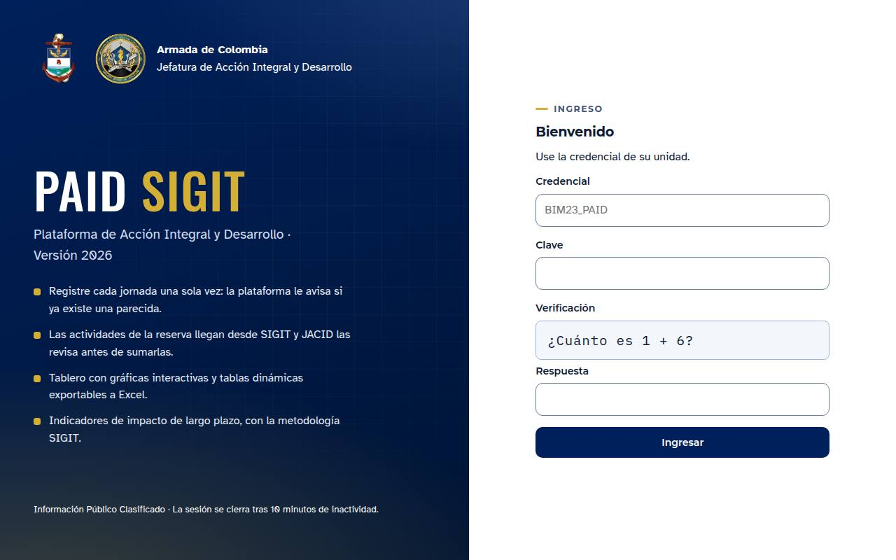
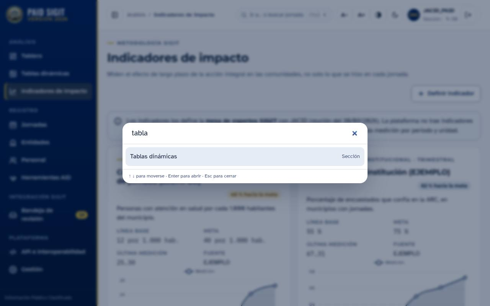
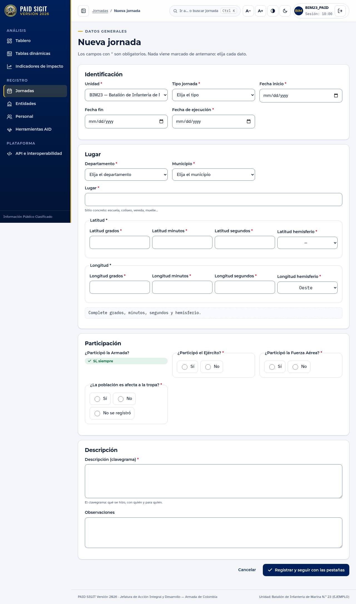
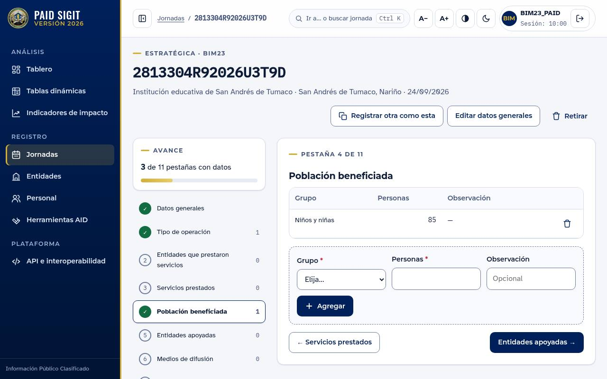
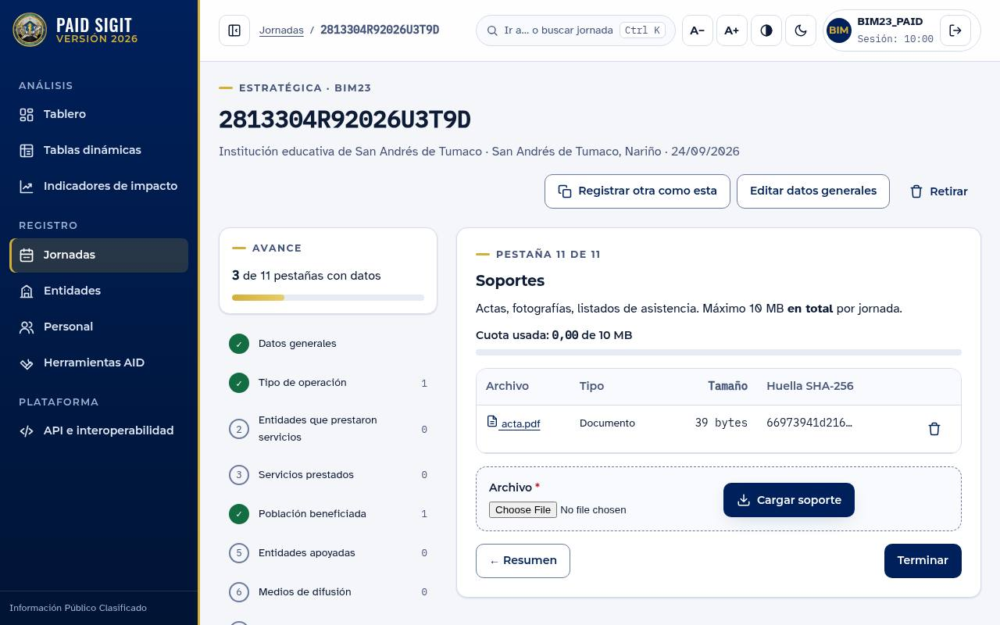
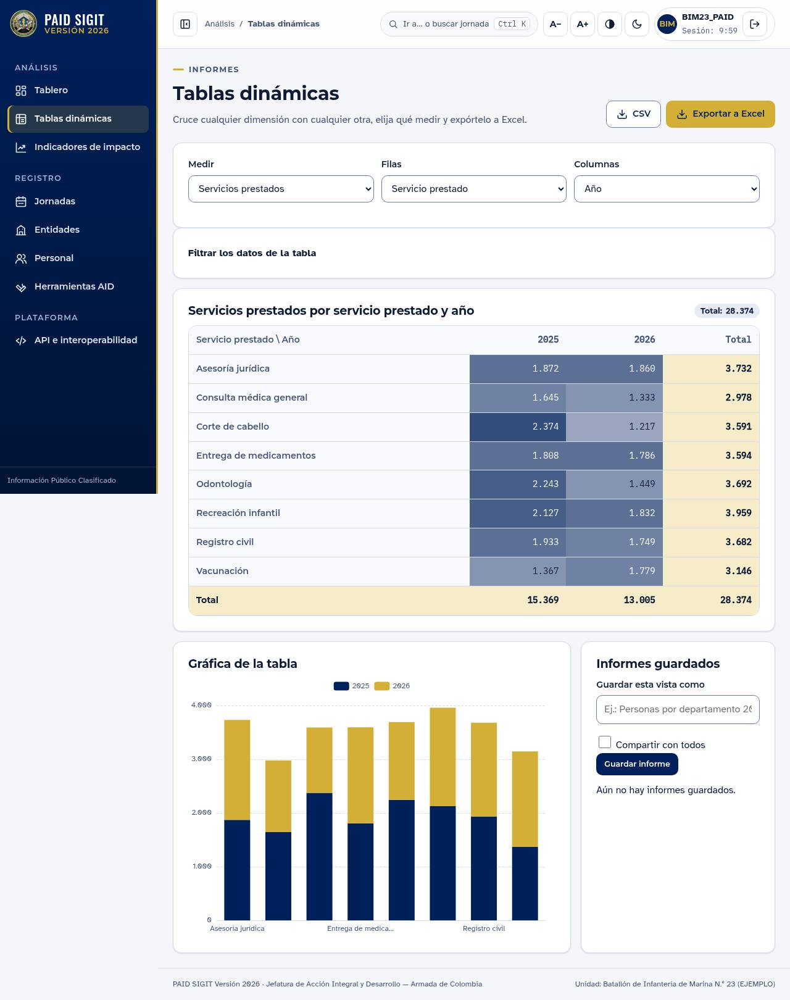
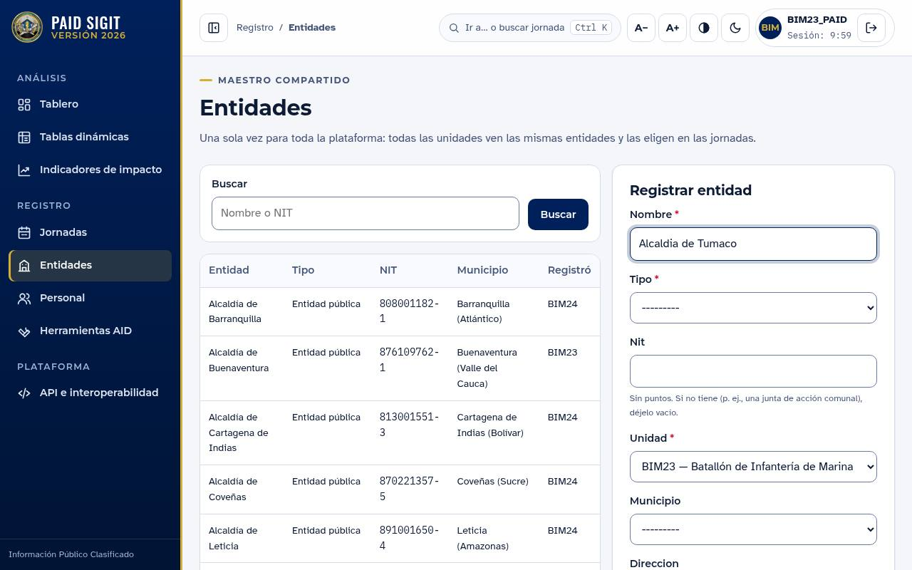
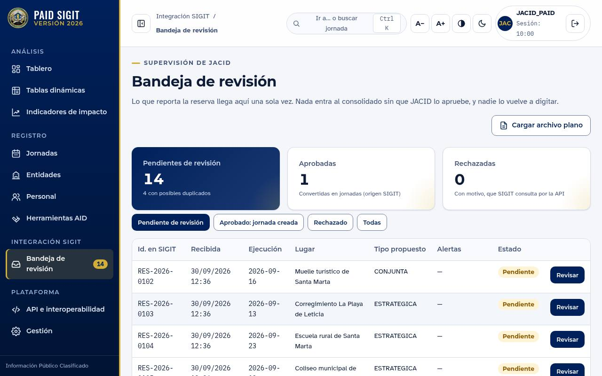
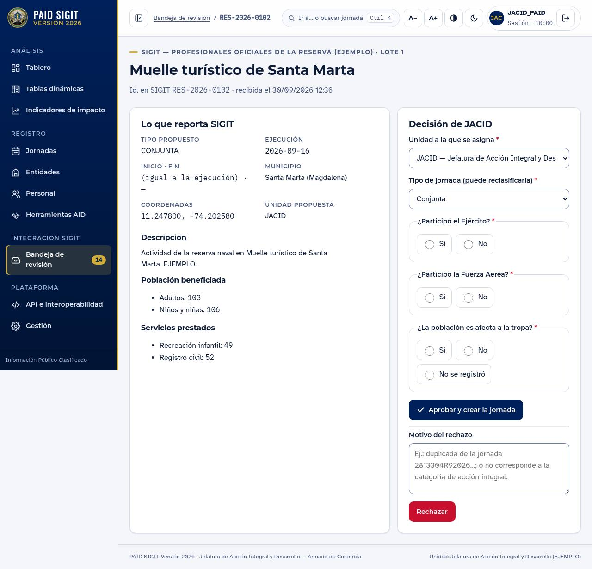
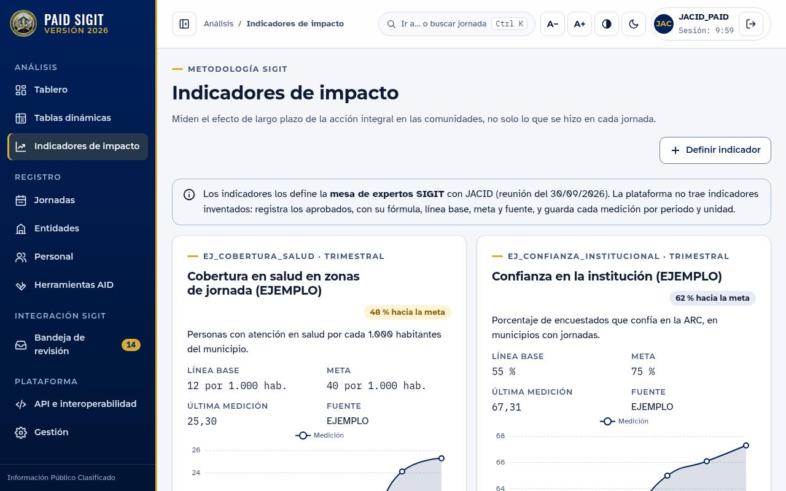

# Manual del usuario — PAID SIGIT Versión 2026

Plataforma de Acción Integral y Desarrollo de la Armada de Colombia, con la
metodología SIGIT de indicadores de impacto.

> Las imágenes de este manual son de la **demostración**: los datos, las
> unidades y varios catálogos dicen «EJEMPLO» y no son oficiales.

## 1. Ingresar

1. Escriba la **credencial de su unidad** (forma `SIGLA_PAID`, por ejemplo
   `BIM23_PAID`) y su **clave**.
2. Resuelva la **verificación** (una suma o una resta sencilla). Cada reto
   sirve una sola vez: si se equivoca, la pantalla le presenta otro.
3. Pulse **Ingresar**.

Si algo no coincide, la plataforma dice siempre lo mismo: «Credenciales
inválidas». Tras **cinco claves erradas** la credencial se bloquea 15 minutos.

La sesión se cierra tras **10 minutos sin actividad**. Dos minutos antes, un
aviso le ofrece **Seguir trabajando**. El reloj de la esquina superior derecha
muestra el tiempo que queda.

## 2. Moverse por la plataforma

- **Menú lateral:** Análisis (tablero, tablas dinámicas, indicadores), Registro
  (jornadas, entidades, personal, herramientas AID), Integración SIGIT (solo
  JACID) y Plataforma. El botón ▯ junto a la ruta pliega el menú.
- **Paleta de órdenes — `Ctrl + K`:** escriba el nombre de una sección o el
  código o lugar de una jornada y pulse Enter. Es la forma más rápida de llegar
  a cualquier parte.

  

- **Accesibilidad**, en la cabecera: **A−** y **A+** cambian el tamaño de la
  letra; ◐ activa el **alto contraste**; ☾ el **modo oscuro**. La plataforma
  recuerda la elección en ese equipo.

## 3. Tablero

Muestra lo que su unidad (y sus subordinadas) ha registrado: jornadas,
personas beneficiadas, servicios prestados y valor de los bienes donados, más
las gráficas por mes, tipo, departamento, grupo poblacional, calendario de
actividad y ubicación.

- **Todas las gráficas responden al clic:** pulse una barra de un mes, un
  sector del tipo de jornada o un departamento, y el tablero se filtra.
  Pulse un punto del mapa de ubicaciones para abrir esa jornada.
- Los **filtros** de arriba (fechas, unidad, tipo, departamento, estado) y los
  atajos «Este año», «Últimos 12 meses», «Último trimestre» cambian todo el
  tablero. Cada filtro activo aparece como una ficha que se quita con ×.

## 4. Registrar una jornada

### 4.1 Datos generales

**Jornadas → Nueva jornada.** Nada viene marcado de antemano: elija cada dato.
Es a propósito: un valor que nadie eligió parece correcto y entra al
consolidado.

- **Departamento y municipio:** al elegir el departamento, el municipio muestra
  solo los suyos.
- **Coordenadas en grados, minutos y segundos.** Debajo aparece el punto en
  decimales y si queda **dentro de Colombia**. Si dice «FUERA de Colombia»,
  revise el hemisferio (Colombia está al oeste: `W`).
- **Participación:** la Armada participa siempre; indique si participaron el
  Ejército y la Fuerza Aérea, y si la población es afecta a la tropa (o «No se
  registró»).

**¿Ya existe?** Si en el mismo municipio, en fechas cercanas, hay una jornada
con un lugar de nombre parecido, la plataforma la muestra antes de guardar.
Ábrala; si es la misma, no la registre otra vez. Si es distinta, marque «Revisé
las jornadas parecidas…» y guarde.

**Atajo — «Registrar otra como esta».** Desde una jornada existente, este
botón abre el formulario con el tipo, el lugar, el municipio y las coordenadas
copiados. Usted solo pone las fechas y lo nuevo. Sirve para las jornadas que
se repiten en el mismo sitio.

### 4.2 Las once pestañas

A la izquierda está el **avance**: cuántas de las once pestañas tienen datos y
cuáles faltan. Cada pestaña se llena sin salir de la página:

1. Elija el elemento y la cantidad en la franja punteada y pulse **Agregar**.
2. Lo que ya agregó **no vuelve a aparecer** en la lista: no se puede repetir.
3. Para corregir, quite la fila (papelera) y agréguela de nuevo.
4. **Siguiente →** lleva a la pestaña que sigue.

La jornada queda **COMPLETA** —y entra al consolidado— cuando las once
pestañas tienen datos, incluido al menos un soporte.

### 4.3 Soportes

Actas, fotografías, listados: PDF, Word, Excel, PowerPoint, JPG, PNG, GIF,
MP3, MP4. **Máximo 10 MB en total por jornada** (la barra muestra lo usado).
La plataforma revisa el **contenido** del archivo: un archivo que no es lo que
dice su extensión no se guarda. El mismo archivo no se puede cargar dos veces.

## 5. Tablas dinámicas

**Análisis → Tablas dinámicas.** Elija:

- **Medir:** número de jornadas, municipios atendidos, personas beneficiadas,
  servicios prestados, valor o cantidad de bienes donados, valor de recursos.
- **Filas** y **Columnas:** año, trimestre, mes, unidad, tipo de jornada,
  departamento, municipio, origen, estado; y, según la medida, grupo
  poblacional, servicio, tipo de bien o de recurso.

La tabla se recalcula al cambiar cualquier opción. Las celdas se colorean según
su valor (mapa de calor) y hay totales por fila, por columna y general. Abajo,
la misma tabla como **gráfica de barras apiladas**.

- **Exportar a Excel** o **CSV:** descarga exactamente lo que ve.
- **Guardar esta vista:** póngale nombre y vuelva a ella con un clic; marque
  «Compartir con todos» para que la vean las demás unidades.

## 6. Entidades, personal y herramientas AID

- **Entidades:** son **compartidas por toda la plataforma**. Mientras escribe
  el nombre, aparecen las que ya existen con un nombre parecido o con el mismo
  NIT. Si la entidad ya está, úsela en las jornadas: no la registre otra vez.
- **Personal:** una persona se registra una sola vez (el documento no se repite).
- **Herramientas AID:** los once tipos del manual. Si está **inactiva**,
  explique por qué y qué gestión se hizo.

## 7. Integración SIGIT (JACID)

Las actividades que reportan los profesionales oficiales de la reserva desde
SIGIT llegan a la **Bandeja de revisión**, por la API o por archivo plano.
**Nada entra al consolidado sin la aprobación de JACID**, y nadie tiene que
volver a digitarlo.

Al abrir una actividad:

1. Lea lo que reporta SIGIT. Si la plataforma encontró **jornadas parecidas ya
   registradas**, las muestra arriba: si es la misma, rechácela como duplicada.
2. Para **aprobar**: elija la unidad, confirme o **cambie el tipo de jornada**
   (reclasificar), responda la participación y pulse **Aprobar y crear la
   jornada**. La jornada se crea con los datos, la población y los servicios
   reportados; complete luego sus demás pestañas.
3. Para **rechazar**: escriba el motivo (obligatorio) y pulse **Rechazar**.
   SIGIT puede consultar el motivo.

**Cargar archivo plano:** descargue la plantilla CSV, llénela (o expórtela
desde SIGIT) y súbala. El resultado dice, fila por fila, qué entró, qué estaba
repetido y qué tenía errores. Volver a subir el mismo archivo no duplica nada.

## 8. Indicadores de impacto

Miden el efecto de largo plazo de la acción integral en las comunidades. Cada
indicador muestra su fórmula, línea base, meta, última medición y la gráfica de
su evolución contra la base y la meta. JACID registra las mediciones por
periodo. **Los indicadores oficiales los define la mesa de expertos SIGIT**;
los que muestra la demostración son de ejemplo.

## 9. Roles

| Rol | Puede |
|---|---|
| Consulta | Ver tablero, tablas dinámicas, jornadas y maestros de su ámbito |
| Operador | Además, registrar y editar jornadas, pestañas, soportes y maestros |
| Revisor JACID | Además, revisar la bandeja de SIGIT y registrar mediciones de indicadores |
| Administrador | Además, la **Gestión**: catálogos, unidades, usuarios y sistemas externos |

Cada unidad ve lo suyo y lo de sus subordinadas; JACID ve todo.
